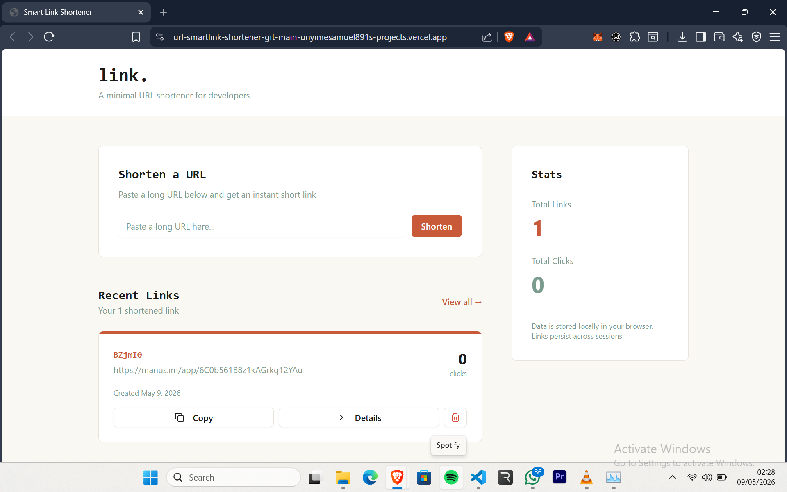

# link. — URL Shortener

A minimal URL shortener with click analytics. Built with React, Express, and Tailwind CSS.

**Live Demo:** [sclip.vercel.app](https://sclip.vercel.app)



## What it does

- Shortens any URL instantly and copies it to clipboard
- Tracks clicks over time with a Recharts line chart
- Dashboard to manage and delete all your links
- JSON file storage — no database setup needed

## Tech stack

- React 19 + TypeScript
- Express.js
- Tailwind CSS + shadcn/ui
- Recharts
- Wouter (routing)
- nanoid (code generation)
- Vite

## Running locally

```bash
git clone https://github.com/unyimesamuel891/url-smartlink-shortener.git
cd url-smartlink-shortener
pnpm install
pnpm dev
```

Open `http://localhost:3000`

## Author

Built by Unyime Duncan — [GitHub](https://github.com/unyimesamuel891)
